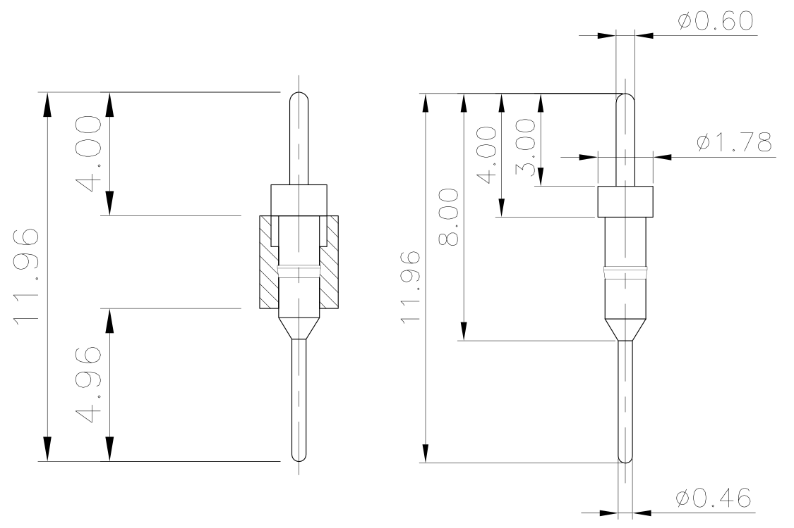

NOTICE this is just an untested proof of concept

# 486 L2 cache adapter for TSOP32/DIP32

Asynchronous fast SRAM chips in DIP32 package, were phased out. This makes not possible to use new chips to upgrade 486 L2 cache. However there are still compatible SRAM variants in SMT packages.

This project aims to create a PCB design, which allows the retro community to put TSOP32 chip into a DIP32 socket.

# Design

DIP32 sockets usually have the absolute maximum dimensions 10 x 40 mm. The adapter need to be less wide than that (and any exceeding PCB space due to a manufacturing tolerances needs to be sanded out).

TSOP32 type I chips needs to have width below this limit too. This reduces the list of possible chips only few types. Also there is a difference between 3.3V and 5V SRAM pinouts. The 3.3V pinouts would be highly complicated to route on 2 layer PCB.

The resulting list of chips I've found is:

* IS61C1024AL-12TLI
* CY7C109D-10ZXI
* AS7C1024B-12TCN

These chips have dimensions around 8 x 20 mm so there will be almost 1 mm between the side of the chip and the edge of the PCB (2 mm between chips on the motherboard).

Sadly a 1 mm space between chip and the PCB edge is not enough for having THT pins for the DIP32 socket. Only SMT pins can be placed below the SRAM TSOP package. If using a pin like this:

The top part needs to be cut and sanded to the wide section, which then needs to be soldered down in a similar way as the BGA or QFN is.

The THT section in the current version of the PCB is using hole size 0.8 mm. So the round/precise pins should fit (usually 0.6 mm). The square pinheader is not supported (it would destroyed the motherboard socket anyway).

All pin sections have extruding copper section nearing the center of the PCB. This should help with QFN-like soldering and it is also allowing for using a 90° angled pinheader.

BTW an older version of the PCB had "half-THT" holes below the TSOP chip, where the pin would end inside the PCB thickness and was soldered only on one side (no copper below the chip). Not sure if this design can be manufactured (essentially a half via), so I removed that.

# Design rules

* Precise (rounded) pinheaders have diameter: 0.47 mm to 0.6 mm
* Hole tolerance (for adapter pins) is: about +- 0.1 mm => THT pad hole diameter 0.8 mm
* Copper clearance to edge: >= 0.2 mm
* Pin mapping is not 1:1, the PCB cannot be used an arbitrary TSOP/DIP adapter

If you have a courage to make the adapter. Please share your experiences.

Licensed under CC BY-NC-SA 4.0

pc2005
